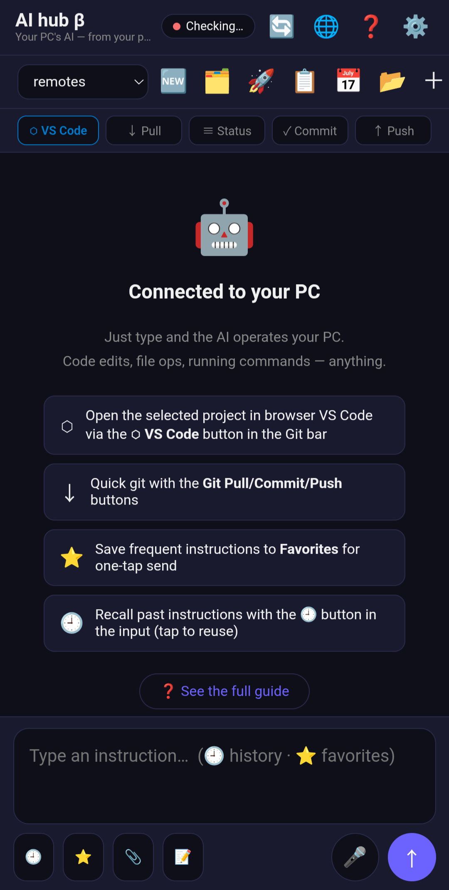
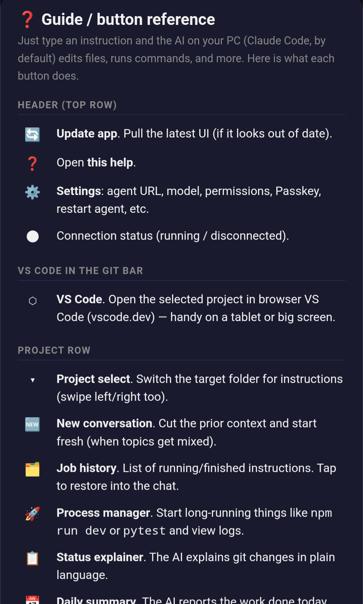

# 📱 AI Coding Hub — スマホから自宅PCの AIコーディングエージェントを動かす

> Run your **AI coding agent** on your home PC, from your phone — **no API bill, no open ports.**
> あなたの Claude **プラン**で動くので**API課金ゼロ**。Cloudflare Tunnel 経由でポート開放も不要。

スマホでアプリを開く → IDE とプロジェクトを選ぶ → 自然言語で指示 → 自宅PCの AIエージェント（既定 Claude Code）が実行 → 人間語で結果を返す。

> 🔌 既定は **Claude Code** ですが、**Gemini CLI / Codex CLI など他の AI エージェントも設定だけで追加可能**（[エンジン](#-エンジン--claude-code-既定--他のai-cliも設定で追加--bring-your-own)）。中継基盤はエンジン非依存です。

[日本語](#日本語) ・ [English](#english) ・ [⭐ Sponsor / 募金](#-support--募金)

---

## 📱 スクリーンショット / Screenshots

<p align="center">
  
  &nbsp;&nbsp;
  
</p>

> 実機 Android（PWA）。UI は 🌐 ボタンで **日本語 / English** を切替（端末の言語も自動判定）。

---

## ⚡ 30秒で始める — AIエージェントに丸投げ

clone して、**お使いの AI コーディングエージェント（Claude Code / Codex / Gemini / Antigravity 等）にこの呪文を貼るだけ**:

> このリポジトリの `README.md` `CLAUDE.md` `AGENTS.md` を読んで、**AI Coding Hub をこの PC・この端末用にセットアップ**して。
> ⚠️ `ANTHROPIC_API_KEY` は絶対に設定しないこと。`setup.ps1` を使い、`agent/.env` と `agent/config.json` を私の環境に合わせて作り、
> 私のエンジン（Claude Code 等）で実際に動くか検証して、動かなければ直して。
> **UI 表示が私の言語でなければ、`ui/i18n.js` に私の言語の辞書を足して翻訳して**。終わったら使い方を3行で教えて。

手動で設定したい人は 📘 [docs/CONFIGURATION.md](docs/CONFIGURATION.md)。使い方が分からなくなったら、このリポを読ませた AI エージェントに聞くのが最速。

---

## 🚨 最初に必ず読む / READ THIS FIRST

### ⚠️ 1. `ANTHROPIC_API_KEY` を絶対に設定しないこと

このシステムは Claude の **プラン枠**（サブスク）で動かす前提です。
環境変数や `.env` に `ANTHROPIC_API_KEY` があると、Claude Code が **API 従量課金**で動き、
**想定外の高額請求**が来ます（[Issue #37686](https://github.com/anthropics/claude-code/issues/37686): 2日で **$1,800** の事例）。

> **このリポジトリは構造的に防止します**：
> - agent サブプロセスの環境から `ANTHROPIC_API_KEY` を毎回除去
> - **キーが環境にあると agent は起動を拒否**（`main.py` の起動ガード）
>
> それでも、自分の OS の環境変数に残っていないか必ず確認してください。

### ⚠️ 2. これは「スマホから自宅PCで任意コマンドを実行」するツールです

Claude Code は `--permission-mode bypassPermissions` で全ツール許可で動きます。つまり
**スマホを持つ人＝あなたのPCでファイル編集・コマンド実行ができる**ということ。**自己責任**で使ってください。

構造的な安全柵（このリポジトリに実装済み）:
- **登録プロジェクト配下でのみ動作**（`config.json` に登録したパス以外では実行不可）
- **危険コマンドのブロック**・レート制限
- **Passkey(WebAuthn) + JWT 認証**、未認証は厳しいレート制限
- **ポート開放ゼロ**（Cloudflare Tunnel が外→中をつなぐ）

それでも **`AGENT_TOKEN` と Passkey を絶対に漏らさないこと**。漏れると他人があなたのPCを操作できます。

---

## 日本語

### 必要なもの
- Windows（PowerShell）で動作確認済み。**Mac/Linux も使えます** — コア（Python/FastAPI）は
  クロスプラットフォームなので、フォークを**自分のAIエージェントに渡して移植させればOK**
  （`*.ps1` を bash 等に書き換え。「Mac で動くように移植して」と頼むだけ）
- Python 3.10+
- [Claude Code CLI](https://docs.claude.com/claude-code) にログイン済み（Claude 有料プラン: Pro or Max）
- Cloudflare アカウント（無料）+ 自分のドメイン or `*.cfargotunnel` 系
- VS Code / Cursor（IDEトンネルを使う場合）

### セットアップ（3 ステップ）
```powershell
git clone https://github.com/<you>/ai-coding-hub.git
cd ai-coding-hub
./setup.ps1        # venv作成・依存導入・AGENT_TOKEN自動生成・.env/config.json生成
./doctor.ps1       # 自己診断（任意）: claude/CLI・.env・APIキー・tunnel をまとめてチェック
./start-all.ps1    # cloudflared / watchdog(8765) / agent(8766) / IDEトンネル を起動
```
起動後、**PCローカル**で `http://127.0.0.1:8765/ui/` を開き、QR でスマホ端末を Passkey 登録。
以降はスマホから `PUBLIC_URL` を開くだけ。

### Cloudflare Tunnel の作り方（概要）
1. Cloudflare Zero Trust → Networks → Tunnels → Create で **トークン**を取得 → `.env` の `CLOUDFLARE_TUNNEL_TOKEN`
2. Public hostname を自分のドメインに設定し `http://127.0.0.1:8765` に向ける
3. そのホスト名を `.env` の `PUBLIC_URL` に（`PASSKEY_RP_ID`/CORS は自動導出）

> **Cloudflare 以外のトンネルも使えます**（ngrok / Tailscale Funnel / frp 等）。要は `127.0.0.1:8765` を
> 公開HTTPSに出せれば何でも可。**ただしセキュリティ上の注意**: watchdog は「インターネット越し vs PCローカル」を
> ヘッダ `cf-connecting-ip` の有無で判定しています（既定）。他トンネルではこのヘッダが無く、
> **そのままだとインターネット越しが“ローカル特権”を得る穴**になります。対策:
> `.env` に `REMOTE_MARKER_HEADER=<そのトンネルが必ず付けるヘッダ名>` を設定するか、
> 確信が持てなければ `ASSUME_REMOTE=1`（全proxyをリモート扱いのフェイルセーフ。端末追加は PC から
> `http://127.0.0.1:8765/ui/` で行う）。詳細は [docs/CONFIGURATION.md](docs/CONFIGURATION.md)。

### 設定の要点（全部 `.env`、個人値はコードに焼かない）
| キー | 役割 |
|---|---|
| `AGENT_TOKEN` | エージェント認証（setup が自動生成） |
| `CLOUDFLARE_TUNNEL_TOKEN` | Cloudflare Tunnel トークン（旧名 `CF_TOKEN` も可） |
| `PUBLIC_URL` | 公開URL。`PASSKEY_RP_ID`/`CORS_ORIGINS` の既定値はここから導出 |
| `config.json` | 登録プロジェクト（**gitignore済**。`config.example.json` が雛形） |

---

## English

**AI Coding Hub** lets you operate **your AI coding agent on your home PC, from your phone** (Claude Code by default; Gemini/Codex/Antigravity via config), running on
your **own Claude plan** (no API billing) over a **Cloudflare Tunnel** (no port forwarding).

> ⚠️ **Never set `ANTHROPIC_API_KEY`** — it switches Claude Code to metered API billing
> (a user reported **$1,800 in 2 days**). The agent **refuses to start** if the key is present.
>
> ⚠️ This is a **remote command runner**: whoever holds the phone token can run commands on your PC.
> Use at your own risk. Guardrails: registered-paths-only, dangerous-command block, Passkey+JWT auth,
> rate limiting, zero open ports. **Keep `AGENT_TOKEN` and your passkey secret.**

```powershell
git clone https://github.com/<you>/ai-coding-hub.git
cd ai-coding-hub
./setup.ps1      # venv + deps + auto-generate AGENT_TOKEN + write .env/config.json
./start-all.ps1  # cloudflared / watchdog / agent / IDE tunnels
```
Open `http://127.0.0.1:8765/ui/` **locally** to register your phone via Passkey (QR), then use it from anywhere.

---

## 🔌 エンジン — Claude Code 既定 ＋ 他のAI CLIも設定で追加 / Bring your own

中継・UI・認証・トンネルは **エンジン非依存**。実際にコードを書くエンジンは差し替え可能です。

- **Claude Code**（既定）… 専用アダプタでツール呼び出しの構造化表示・会話継続(resume)に対応。
- **その他の CLI**（Gemini CLI / Codex CLI など）… **コードを書かず `agent/config.json` の設定だけ**で追加できます（`generic_cli` が起動して出力を素テキストで返す“二級”対応）。

```jsonc
// agent/config.json （雛形は config.example.json）
"default_engine": "claude_code",
"engines": {
  "gemini":      { "cmd": "gemini", "args": ["-p", "{prompt}"], "prompt_via": "arg",   "strip_env": ["GEMINI_API_KEY"] },
  "codex":       { "cmd": "codex",  "args": ["exec"],            "prompt_via": "stdin", "strip_env": ["OPENAI_API_KEY"] },
  "antigravity": { "cmd": "agy",    "args": ["-p", "{prompt}"], "prompt_via": "arg" }   // Google Antigravity CLI
}
```
`{prompt}`/`{cwd}` を置換、`prompt_via` で標準入力/引数を選択、`strip_env` でそのエンジンの
**APIキー課金を回避**（＝Claude と同じ“サブスクで動かす・API課金ゼロ”の思想を各エンジンで踏襲）。
**ヘッドレス実行できる AI コーディング CLI** なら載ります:
- **Claude Code**（既定・専用アダプタ） / **Gemini CLI**（`gemini -p`） / **OpenAI Codex CLI**（`codex exec`） /
  **Google Antigravity CLI**（`agy -p`、アカウント認証＝APIキー不要）
- それぞれ**自分のサブスク枠**で動く（API課金ゼロ）

> ⚠️ Claude Code 以外の設定は**ひな形**です。各 CLI の正確な起動引数はバージョンで変わるので、
> 導入時に手元の CLI で1度確認してください（リッチ表示・resume が要るなら専用アダプタを1枚足す）。
> ※ IDE（Antigravity アプリ等）は別軸＝IDEトンネルで“ブラウザで開く”用途。エンジンは**ヘッドレスCLI**のみ。

## 🆚 公式アプリ / クラウド版との違い

スマホからAIに頼む手段は他にもあります（公式アプリ、クラウド版 Claude Code、各種 remote 機能 等）。
それらは**手軽で完成度が高い**。このプロジェクトが取るのは**別の軸**です:

| | クラウド型（公式/channels 等） | **AI Coding Hub（これ）** |
|---|---|---|
| 動く場所 | 提供元のクラウド/サンドボックス | **自分の物理PC**（実ファイル・ローカルDB・dev server・未コミット作業に届く） |
| 費用 | API従量 / クラウド計算課金 | **自分のサブスク枠で $0 API**（Claude/Codex/Gemini ログイン） |
| エンジン | ベンダー固定 | **Claude / Codex / Gemini / Antigravity から選択** |
| プライバシー | コードが先方サーバに乗る | **自分のマシンから出ない**（自分のトンネルのみ） |
| 公開/改造 | クローズド | **MIT・フォーク・AIで改造自由** |

> 一言で: **「他人のクラウドでAIを動かす」のではなく「自分のPCで・自分の契約で・自分のAIを、スマホから動かす」。**
> 完成度・手軽さが欲しいなら公式、**コントロール/プライバシー/コスト/ローカル環境/マルチベンダー/OSS**が欲しいならこれ。

## 🧪 検証状況（正直に） / Verification status

**Android × iPhone**、**Claude Code / Codex / Gemini / Antigravity** で使える設計ですが、
**実機検証できているのは Android ＋ Claude Code だけ**。他は実装済み・未検証です。

| 端末＼エンジン | Claude Code | OpenAI Codex | Gemini CLI | Google Antigravity |
|---|:---:|:---:|:---:|:---:|
| **Android** | ✅ 検証済 | 🟡 未検証 | 🟡 未検証 | 🟡 未検証 |
| **iPhone** | 🟡 未検証 | 🟡 未検証 | 🟡 未検証 | 🟡 未検証 |

✅ = 実機確認済み / 🟡 = コードは対応・**各自の端末/CLIで要検証**（合わなければ編集して使う前提）

> 🙏 **検証を手伝ってくれる人募集**: あなたの端末×エンジンで動いたら Issue/PR で「✅」報告を。
> このマトリクスを一緒に埋めていきましょう。

## 🤖 使い方：自分の AI エージェントに任せるのが正解

このリポジトリは **「あなたのお使いの AI コーディングエージェント（Claude Code / Codex / Gemini / Antigravity 等）に
このページごと読み込ませて、設定・改造・使い方まで任せる」** ことを前提に作っています。

おすすめの流れ:
1. フォークを clone し、**AI エージェントにこのリポジトリ＋[CLAUDE.md](CLAUDE.md)（や [AGENTS.md](AGENTS.md)）を読ませる**
2. 「**自分用に設定して**」「**この端末で動くか検証して直して**」「Gemini を engines に追加して」と頼む
3. **使い方が分からなければ AI エージェントに聞く**（このリポを読んだ上で答えてくれる）
4. エージェントが固定事項を踏まえて `.env`/`config.json`/コードを編集

→ 公式の“全部入りUI”を待つより、**各自が自分のエージェントで設定・拡張**するのが速くて自由。

**AI に読ませるファイルは同梱済み**: [CLAUDE.md](CLAUDE.md)（詳細な設計・固定事項）／ [AGENTS.md](AGENTS.md)（Claude 以外のエージェント向け入口）。
**手動で設定したい人向け**の説明書も用意: 📘 [docs/CONFIGURATION.md](docs/CONFIGURATION.md)。

---

## 💜 Support / 寄付 <a id="support"></a>

OSS（MIT）です。各自が自分の Claude アカ・自分のPCで動かすため、こちらに継続コストは発生しません。
気に入ったら応援してもらえると、メンテと新機能の励みになります 🙏

**2 つの方法 / Two ways to support:**

### 1. GitHub Sponsors（fiat / カード）
[](https://github.com/sponsors/baadee55)
→ https://github.com/sponsors/baadee55

### 2. Crypto（口座不要・世界中どこからでも / no account needed）
送金が一番ラクなのは **USDT (TRC20)**。

| Coin / Network | Address |
|---|---|
| **ETH / ERC-20 / USDT-ERC20** | `0xD9397E6d6e2b45eaf38182fbE93213bf63A97b50` |
| **USDT — TRON (TRC20)** | `TL2QgdD9684N7bjfYFT9e5Mc6PBwoXAbC9` |
| **BTC** | `33SU1T3Dip6btiLS8FnDMoDu8xFYvUuuHz` |

> ⚠️ 必ず**ネットワークを一致**させて送ってください（TRC20宛にERC20で送る等は紛失します）。
> Please match the network exactly when sending.

## License
[MIT](LICENSE)。`ANTHROPIC_API_KEY` 課金・任意コマンド実行のリスクは利用者の自己責任です。
