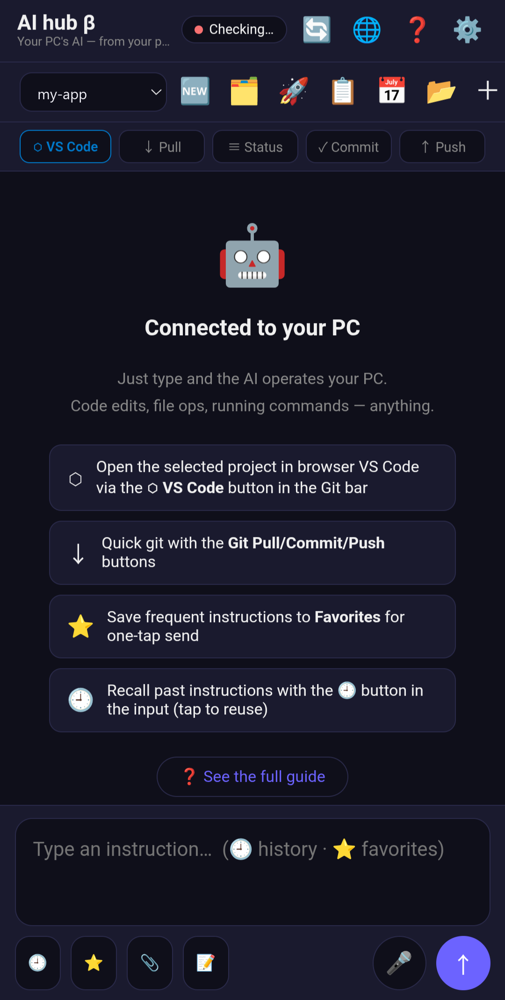
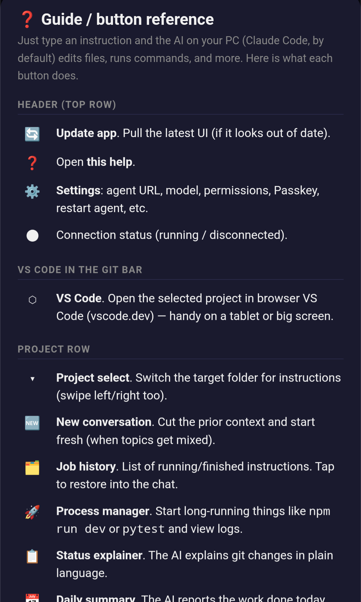

# 📱 AI Coding Hub — run your home-PC AI coding agent from your phone

> Run your **AI coding agent** on your home PC, from your phone — **no API bill, no open ports.**
> It runs on your own Claude **plan** (zero API billing), over a Cloudflare Tunnel (no port forwarding).

Open the app on your phone → pick an IDE and project → give instructions in plain language → the AI agent on your home PC (Claude Code by default) does the work → results come back in plain language.

> 🔌 **Claude Code** is the default, but **other AI agents (Gemini CLI / Codex CLI, etc.) can be added by config** (API level — see the limitation in Engines) ([Engines](#-engines--claude-code-default--bring-your-own)). The relay layer is engine-agnostic.

[English](#english) · [日本語](#日本語)

> 🇯🇵 日本語の説明は下の [**日本語**](#日本語) セクションにあります。

---

## 📱 Screenshots

<p align="center">
  
  &nbsp;&nbsp;
  
</p>

> Real Android device (PWA). The UI switches between **English / 日本語** with the 🌐 button (it also auto-detects the device language).

---

## ⚡ Start in 30 seconds — let your AI agent do it

Clone the repo, then **paste this prompt into your AI coding agent (Claude Code / Codex / Gemini / Antigravity, etc.)**:

> Read `README.md`, `CLAUDE.md` and `AGENTS.md` in this repo, and **set up AI Coding Hub for this PC and this device**.
> ⚠️ Never set `ANTHROPIC_API_KEY`. Use `setup.ps1`, generate `agent/.env` and `agent/config.json` for my environment,
> verify it actually runs with my engine (Claude Code, etc.), and fix it if it doesn't.
> **If the UI is not in my language, add a dictionary for my language to `ui/i18n.js` and translate it.**
> When you're done, tell me how to use it in 3 lines.

Prefer to configure it by hand? See 📘 [docs/CONFIGURATION.md](docs/CONFIGURATION.md). If you get stuck, the fastest fix is to ask the AI agent that has read this repo.

---

## 🚨 READ THIS FIRST

### ⚠️ 1. Never set `ANTHROPIC_API_KEY`

This system is designed to run on your Claude **plan** (subscription).
If `ANTHROPIC_API_KEY` is present in your environment or `.env`, Claude Code switches to **metered API billing**, and you can get **an unexpectedly huge bill** ([Issue #37686](https://github.com/anthropics/claude-code/issues/37686): a reported **$1,800 in 2 days**).

> **This repo prevents that structurally:**
> - it strips `ANTHROPIC_API_KEY` from the agent subprocess environment every time, and
> - **the agent refuses to start if the key is present in the environment** (startup guard in `main.py`).
>
> Even so, double-check that the key isn't left in your OS environment variables.

### ⚠️ 2. This is a "run arbitrary commands on your home PC, from your phone" tool

Claude Code runs with `--permission-mode bypassPermissions` (all tools allowed). That means
**whoever holds the phone can edit files and run commands on your PC.** Use it **at your own risk.**

Structural guardrails (already implemented in this repo):
- **Working directory limited to registered projects** (Claude Code is started inside paths registered in `config.json`; this sets where it starts — it is *not* an OS-level sandbox)
- **Best-effort dangerous-command deny-list** (process runner only — not a sandbox) and rate limiting
- **Passkey (WebAuthn) + JWT auth**; unauthenticated requests get strict rate limits
- **Zero open ports** (the Cloudflare Tunnel connects inbound for you)
- ⚠️ Requests made **directly from the PC itself** (127.0.0.1) skip authentication (that is how you register your first device). Don't run this on a shared PC. Requests whose `Host` header isn't a loopback name are never treated as local (blocks DNS-rebinding from web pages).

Even so, **never leak your `AGENT_TOKEN` or passkey.** If leaked, someone else can operate your PC.

---

## English

**AI Coding Hub** lets you operate **your AI coding agent on your home PC, from your phone** (Claude Code by default; Gemini/Codex/Antigravity via config), running on
your **own Claude plan** (no API billing) over a **Cloudflare Tunnel** (no port forwarding).

> ⚠️ **Never set `ANTHROPIC_API_KEY`** — it switches Claude Code to metered API billing
> (a user reported **$1,800 in 2 days**). The agent **refuses to start** if the key is present.
>
> ⚠️ This is a **remote command runner**: whoever holds the phone token can run commands on your PC.
> Use at your own risk. Guardrails: registered-project working directory, best-effort command deny-list (process runner only), Passkey+JWT auth,
> rate limiting, zero open ports. **Keep `AGENT_TOKEN` and your passkey secret.**

### Requirements
- Verified on **Windows (PowerShell)**. **Mac/Linux also work** — the core (Python/FastAPI) is
  cross-platform, so hand a fork to **your own AI agent and have it port the `*.ps1` scripts** to bash
  (just ask "make it work on Mac").
- Python 3.10+
- [Claude Code CLI](https://docs.claude.com/claude-code), logged in (paid Claude plan: Pro or Max)
- A Cloudflare account (free) with a domain managed on Cloudflare (for the tunnel's public hostname)
- VS Code / Cursor (if you use the IDE tunnel)

### Setup (3 steps)
```powershell
git clone https://github.com/<you>/ai-coding-hub.git
cd ai-coding-hub
./setup.ps1        # create venv, install deps, auto-generate AGENT_TOKEN, write .env/config.json
./doctor.ps1       # self-check (optional): claude CLI, .env, API key, tunnel — all at once
./start-all.ps1    # start cloudflared / watchdog(8765) / agent(8766) / IDE tunnels
```
> If PowerShell refuses to run the scripts (default execution policy), use `powershell -ExecutionPolicy Bypass -File .\setup.ps1` (same for the others).
> `start-all.ps1` also starts VS Code / Cursor tunnels if those are installed (first run asks you to sign in); delete that block if you don't want them.

After it starts, open `http://127.0.0.1:8765/ui/` **locally on the PC** and register your phone via Passkey (QR).
From then on, just open `PUBLIC_URL` from your phone.

### Creating the Cloudflare Tunnel (overview)
1. Cloudflare Zero Trust → Networks → Tunnels → Create to get a **token** → put it in `.env` as `CLOUDFLARE_TUNNEL_TOKEN`
2. Set a Public hostname on your domain and point it at `http://127.0.0.1:8765`
3. Put that hostname in `.env` as `PUBLIC_URL` (`PASSKEY_RP_ID`/CORS are derived automatically)

> **Tunnels other than Cloudflare also work** (ngrok / Tailscale Funnel / frp, etc.). All you need is to
> expose `127.0.0.1:8765` over public HTTPS. **But note a security caveat:** the watchdog distinguishes
> "over the internet vs. local on the PC" by the presence of the `cf-connecting-ip` header (default).
> Other tunnels don't add that header, so **as-is, internet traffic would gain "local privileges"** — a hole.
> Fix it by setting `REMOTE_MARKER_HEADER=<a header that tunnel always adds>` in `.env`, or if you're not
> sure, `ASSUME_REMOTE=1` (fail-safe: treat every proxy as remote; add devices from the PC at
> `http://127.0.0.1:8765/ui/`). Details: [docs/CONFIGURATION.md](docs/CONFIGURATION.md).
>
> `start-all.ps1` currently requires `CLOUDFLARE_TUNNEL_TOKEN`; with another tunnel, start `agent/watchdog.py` and `agent/main.py` yourself (or edit the script).

### Key settings (all in `.env`; never bake personal values into code)
| Key | Role |
|---|---|
| `AGENT_TOKEN` | Agent auth (auto-generated by setup) |
| `CLOUDFLARE_TUNNEL_TOKEN` | Cloudflare Tunnel token (legacy `CF_TOKEN` also accepted) |
| `PUBLIC_URL` | Public URL. Defaults for `PASSKEY_RP_ID`/`CORS_ORIGINS` are derived from it |
| `config.json` | Registered projects (**gitignored**; `config.example.json` is the template) |

---

## 日本語

スマホでアプリを開く → IDE とプロジェクトを選ぶ → 自然言語で指示 → 自宅PCの AIエージェント（既定 Claude Code）が実行 → 人間語で結果を返す。あなたの Claude **プラン**で動くので **API課金ゼロ**。Cloudflare Tunnel 経由でポート開放も不要。

### 必要なもの
- Windows（PowerShell）で動作確認済み。**Mac/Linux も使えます** — コア（Python/FastAPI）は
  クロスプラットフォームなので、フォークを**自分のAIエージェントに渡して移植させればOK**
  （`*.ps1` を bash 等に書き換え。「Mac で動くように移植して」と頼むだけ）
- Python 3.10+
- [Claude Code CLI](https://docs.claude.com/claude-code) にログイン済み（Claude 有料プラン: Pro or Max）
- Cloudflare アカウント（無料）+ Cloudflare で管理している自分のドメイン
- VS Code / Cursor（IDEトンネルを使う場合）

### セットアップ（3 ステップ）
```powershell
git clone https://github.com/<you>/ai-coding-hub.git
cd ai-coding-hub
./setup.ps1        # venv作成・依存導入・AGENT_TOKEN自動生成・.env/config.json生成
./doctor.ps1       # 自己診断（任意）: claude/CLI・.env・APIキー・tunnel をまとめてチェック
./start-all.ps1    # cloudflared / watchdog(8765) / agent(8766) / IDEトンネル を起動
```
> PowerShell がスクリプト実行を拒否する場合は `powershell -ExecutionPolicy Bypass -File .\setup.ps1`（他も同様）。
> `start-all.ps1` は VS Code / Cursor が入っていれば IDE トンネルも起動します（初回はサインインが必要）。不要ならそのブロックを削除してください。

起動後、**PCローカル**で `http://127.0.0.1:8765/ui/` を開き、QR でスマホ端末を Passkey 登録。
以降はスマホから `PUBLIC_URL` を開くだけ。

### Cloudflare Tunnel の作り方（概要）
1. Cloudflare Zero Trust → Networks → Tunnels → Create で **トークン**を取得 → `.env` の `CLOUDFLARE_TUNNEL_TOKEN`
2. Public hostname を自分のドメインに設定し `http://127.0.0.1:8765` に向ける
3. そのホスト名を `.env` の `PUBLIC_URL` に（`PASSKEY_RP_ID`/CORS は自動導出）

> **Cloudflare 以外のトンネルも使えます**（ngrok / Tailscale Funnel / frp 等）。要は `127.0.0.1:8765` を
> 公開HTTPSに出せれば何でも可。**ただしセキュリティ上の注意**: watchdog は「インターネット越し vs PCローカル」を
> ヘッダ `cf-connecting-ip` の有無で判定しています（既定）。他トンネルではこのヘッダが無く、
> **そのままだとインターネット越しが“ローカル特権”を得る穴**になります。対策:
> `.env` に `REMOTE_MARKER_HEADER=<そのトンネルが必ず付けるヘッダ名>` を設定するか、
> 確信が持てなければ `ASSUME_REMOTE=1`（全proxyをリモート扱いのフェイルセーフ。端末追加は PC から
> `http://127.0.0.1:8765/ui/` で行う）。詳細は [docs/CONFIGURATION.md](docs/CONFIGURATION.md)。
>
> `start-all.ps1` は現状 `CLOUDFLARE_TUNNEL_TOKEN` が必須です。他トンネルでは `agent/watchdog.py` と `agent/main.py` を自分で起動する（またはスクリプトを編集）。

### 設定の要点（全部 `.env`、個人値はコードに焼かない）
| キー | 役割 |
|---|---|
| `AGENT_TOKEN` | エージェント認証（setup が自動生成） |
| `CLOUDFLARE_TUNNEL_TOKEN` | Cloudflare Tunnel トークン（旧名 `CF_TOKEN` も可） |
| `PUBLIC_URL` | 公開URL。`PASSKEY_RP_ID`/`CORS_ORIGINS` の既定値はここから導出 |
| `config.json` | 登録プロジェクト（**gitignore済**。`config.example.json` が雛形） |

---

## 🔌 Engines — Claude Code default ＋ bring your own

> ⚠️ **Current limitation:** the phone UI's main path (`/jobs`) always runs Claude Code. Engines added via `config.json` are reachable through the `/command` API (plain-text output); wiring them into the UI job flow is left to you (ask your AI agent).

The relay / UI / auth / tunnel layer is **engine-agnostic**. The engine that actually writes code is swappable.

- **Claude Code** (default) … a dedicated adapter with structured tool-call display and conversation resume.
- **Other CLIs** (Gemini CLI / Codex CLI, etc.) … add them **with config only, no code** in `agent/config.json`
  (`generic_cli` launches them and returns their output as plain text — a "second-class" integration).

```jsonc
// agent/config.json (template: config.example.json)
"default_engine": "claude_code",
"engines": {
  "gemini":      { "cmd": "gemini", "args": ["-p", "{prompt}"], "prompt_via": "arg",   "strip_env": ["GEMINI_API_KEY"] },
  "codex":       { "cmd": "codex",  "args": ["exec"],            "prompt_via": "stdin", "strip_env": ["OPENAI_API_KEY"] },
  "antigravity": { "cmd": "agy",    "args": ["-p", "{prompt}"], "prompt_via": "arg" }   // Google Antigravity CLI
}
```
`{prompt}`/`{cwd}` are substituted, `prompt_via` picks stdin vs. argument, and `strip_env`
**avoids that engine's API-key billing** (i.e. each engine follows the same "run on the subscription, zero API billing" idea as Claude).
**Any AI coding CLI that can run headless** can be plugged in:
- **Claude Code** (default, dedicated adapter) / **Gemini CLI** (`gemini -p`) / **OpenAI Codex CLI** (`codex exec`) /
  **Google Antigravity CLI** (`agy -p`, account auth = no API key needed)
- Each runs on **your own subscription** (zero API billing)

> ⚠️ The non-Claude configs are **templates**. Each CLI's exact launch args change with versions, so
> confirm once against your local CLI when you add it (if you need rich display / resume, add one dedicated adapter).
> ※ IDEs (the Antigravity app, etc.) are a separate axis = the IDE tunnel for "open in a browser". Engines are **headless CLIs only**.

> 🇯🇵 **要点（日本語）**: 中継・UI・認証・トンネルはエンジン非依存。既定の Claude Code は専用アダプタ（リッチ表示・resume 対応）。
> Gemini/Codex 等は `agent/config.json` の設定だけで追加でき（`generic_cli` が素テキストで返す）、`strip_env` で各エンジンの API 課金も回避します。
> 各 CLI の起動引数はバージョンで変わるので、導入時に手元で1度確認してください。

## 🆚 How it differs from official apps / cloud versions

There are other ways to ask AI from your phone (official apps, cloud Claude Code, various remote features).
Those are **convenient and polished**. This project takes a **different axis**:

| | Cloud type (official / channels, etc.) | **AI Coding Hub (this)** |
|---|---|---|
| Where it runs | The provider's cloud/sandbox | **Your own physical PC** (real files, local DB, dev server, uncommitted work) |
| Cost | Metered API / cloud compute | **$0 API on your own subscription** (Claude/Codex/Gemini login) |
| Engine | Vendor-locked | **Claude Code in the UI; Codex / Gemini / Antigravity via config (`/command`)** |
| Privacy | Code goes to their servers | **Stays on your machine and your own tunnel** (Claude Code itself still sends prompts / code context to Anthropic's API) |
| Open/modify | Closed | **MIT — fork and modify with AI freely** |

> In one line: **not "run AI on someone else's cloud," but "run your own AI, on your own PC, on your own plan — from your phone."**
> Want polish and convenience → the official options. Want **control / privacy / cost / local environment / multi-vendor / OSS** → this.

> 🇯🇵 一言で: **「他人のクラウドでAIを動かす」のではなく「自分のPCで・自分の契約で・自分のAIを、スマホから動かす」。**
> 完成度・手軽さが欲しいなら公式、コントロール/プライバシー/コスト/ローカル環境/マルチベンダー/OSS が欲しいならこれ。

## 🧪 Verification status (being honest)

It's **designed** to work on **Android × iPhone** with **Claude Code / Codex / Gemini / Antigravity**, but
**only Android + Claude Code has actually been verified on a real device.** The rest are implemented but unverified.

| Device ＼ Engine | Claude Code | OpenAI Codex | Gemini CLI | Google Antigravity |
|---|:---:|:---:|:---:|:---:|
| **Android** | ✅ verified | 🟡 unverified | 🟡 unverified | 🟡 unverified |
| **iPhone** | 🟡 unverified | 🟡 unverified | 🟡 unverified | 🟡 unverified |

✅ = verified on a real device / 🟡 = code supports it, **verify on your own device/CLI** (expect to edit it if it doesn't fit)

> 🙏 **Help wanted — verification:** if it works on your device × engine, report a "✅" via Issue/PR.
> Let's fill in this matrix together.

## 🤖 How to use it: let your own AI agent handle it

This repo is built on the assumption that you **load this whole page into your AI coding agent
(Claude Code / Codex / Gemini / Antigravity, etc.) and let it handle setup, customization, and usage.**

Recommended flow:
1. Clone your fork and **have your AI agent read this repo + [CLAUDE.md](CLAUDE.md) (and [AGENTS.md](AGENTS.md))**
2. Ask it to "**set it up for me**", "**verify it runs on this device and fix it**", "add Gemini to engines"
3. **If you don't know how to use something, ask the AI agent** (it answers having read this repo)
4. The agent edits `.env`/`config.json`/code based on the fixed constraints

→ Rather than waiting for an official "all-in-one UI", **everyone configures and extends it with their own agent** — faster and freer.

**The files to feed the AI are included**: [CLAUDE.md](CLAUDE.md) (detailed design & fixed constraints) / [AGENTS.md](AGENTS.md) (entry point for non-Claude agents).
**For those who want to configure by hand**, there's a manual too: 📘 [docs/CONFIGURATION.md](docs/CONFIGURATION.md).

---

## License
[MIT](LICENSE). The risks of `ANTHROPIC_API_KEY` billing and arbitrary command execution are the user's own responsibility.
